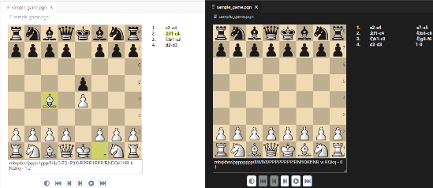

# PGN Viewer

This extension provides an interactive viewer for chess Portable Game Notation (pgn) files. The viewer shows the game details, moves and a board on which to play through the moves.

This is useful for replying and reviewing games or studying opening lines.

The PGN viewer uses background and foreground colors from the current editor theme, for example, to display in dark or light:

## Features

When the user opens a `.pgn` file, the extension will automatically open the file in its viewer. The board and move list will be displayed and the user can play through the moves by clicking on them or the navigation buttons below the board.

Alternately, if the PGN text is already open in an editor window, choosing the `Open In PGN Viewer` command from the command palette (`Ctrl+Shift+P` or `Cmd+Shift+P` on Mac) will open the file in this viewer.

If a directory is open in the editor, a `.pgn` file can be opened directly by selecting it, or right-click on the file, select `Open With...` and choose `PGN Viewer` from the menu.

## Requirements

Uses [@mliebelt/pgn-viewer](https://www.npmjs.com/package/@mliebelt/pgn-viewer).

## Extension Settings

| Name | Description | Default Value |
|------|-------------|---------------|
| Theme | `vscode-pgn-viewer.theme` Choose which theme to use for the board. | `default` |
| Piece Style | `vscode-pgn-viewer.pieceStyle` Choose which set of pieces to use on the board. | `merida` |
| Board Size | `vscode-pgn-viewer.boardSize` Choose the size of the board. | 400 |
| Moves List Width | `vscode-pgn-viewer.movesWidth` Choose the width of the moves list. | 200 |
| Moves List Height | `vscode-pgn-viewer.movesHeight` Choose the height of the moves list. | 200 |
| Layout | `vscode-pgn-viewer.layout` Choose the position of the board relative to the moves list. | `left` |
| Notation Layout | `vscode-pgn-viewer.notationLayout` Choose notation layout. | `list` |
| Move Notation | `vscode-pgn-viewer.moveNotation` Choose the move notation. | `short` |
| Show Result | `vscode-pgn-viewer.showResult` Show the game result, if available. | true |
| Show Coordinates | `vscode-pgn-viewer.showCoordinates` Whether the board coordinates should be shown. | false |
| Show FEN | `vscode-pgn-viewer.showFen` Whether to show the FEN for the current position. | false |
| Show Headers | `vscode-pgn-viewer.showHeaders` Whether to show headers (e.g. player names). | true |

## Known Issues

- Results are unknown if the provided PGN data is invalid.
- The game position reverts to its initial state when configuration changes are made
- The game position reverts to its initial state if the editor tab is hidden and then made visible again

## Release Notes

### 1.1.0

- Allow configuration of the board and moves list etc. See [Extension Settings](#extension-settings)

### 1.0.2

- Ensure the page redraws if the user changes tab

### 1.0.1

- Documentation tweaks

### 1.0.0

- Initial release
- Provides an interactive viewer for chess games stored as PGN files
- The viewer is registered as the default handler for `.pgn` files, and provides an `Open In PGN Viewer` command
- The viewer displays a board, move list and annotations. These are fully interactive to allow the moves to be played and reviewed
- This extension works with Code on the desktop and for the web (e.g. [vscode.dev](https://vscode.dev))
- The PGN viewer uses background and foreground colors from the current editor theme
- More layout and configuration options will be provided in a subsequent update

